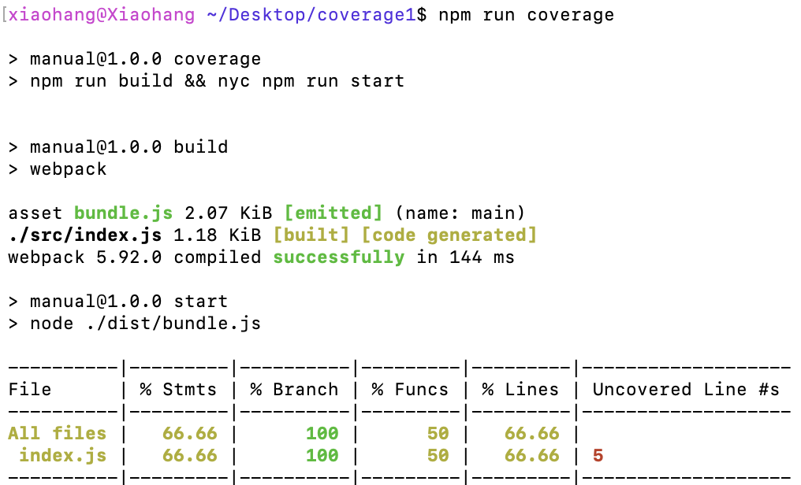
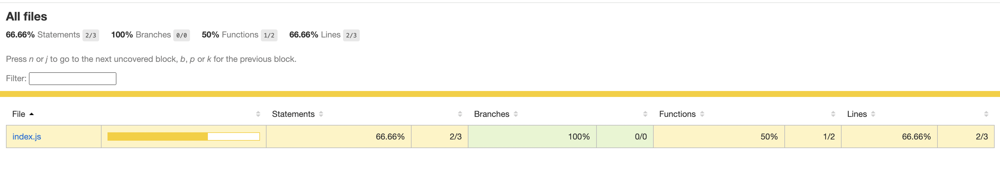
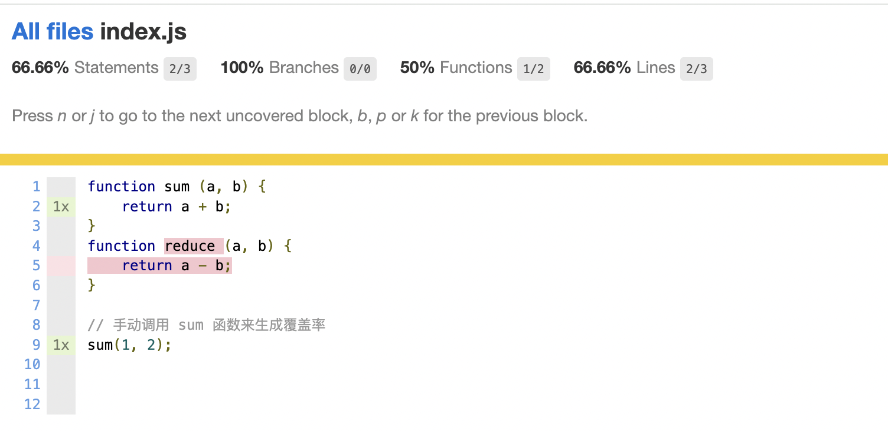
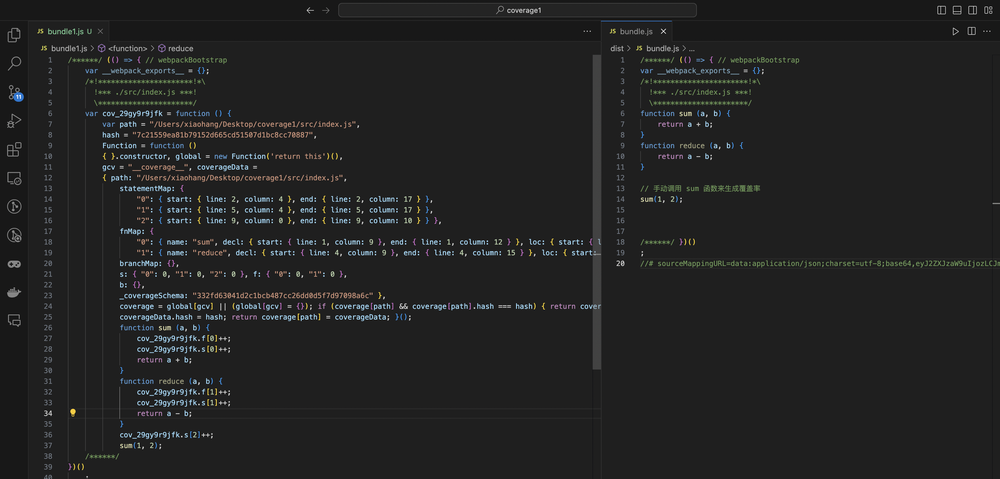
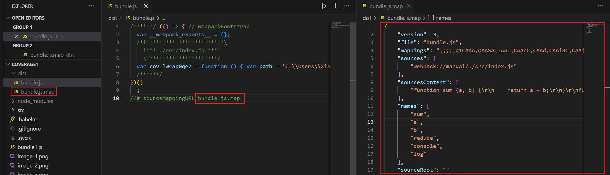

1. 环境准备 需要用到的包
```bash
    node 18.16.0
    # Javascript 代码编辑
    "@babel/core": "^7.24.7",
    "@babel/preset-env": "^7.24.7",
    "babel-loader": "^9.1.3",
    # 打包时使用的 module， 给代码中注入新的方法
    # https://v4.webpack.js.org/loaders/istanbul-instrumenter-loader/
    "istanbul-instrumenter-loader": "^3.0.1",
    # 数据收集工具
    "nyc": "^17.0.0",
    # 打包工具
    "webpack": "^5.92.0",
    "webpack-cli": "^5.1.4"
```
2. 如何使用
   1. 创建一个简单的js 项目 ，项目结构如下 
        ```html
            ├── src
            │   └── index.js 
            ├── .nycrc
            ├── .babelrc
            ├── package.json
            ├── package-lock.json
            └── webpack.config.js
        ```
   2. 每个文件里都有什么，怎么使用 
        index.js 
        ```js
        function sum (a, b) {
            return a + b;
        }
        function reduce (a, b) {
            return a - b;
        }

        // 手动调用 sum 函数来生成覆盖率
        sum(1, 2);
        ```
        .nycrc 配置 nyc 获取哪些文件的覆盖率 和 数据输出 位置
        ```json
        {
            "include": ["src"],
            "exclude": ["dist"],
            "reporter": ["html", "text"],
            "all": true,
            "report-dir": "./coverage"
        }
        ```
        package.json
        ```json
        {
            "build": "webpack",// 使用webpack 将index.js 打包成 dist 文件
            "start": "node ./dist/bundle.js",// 执行打包好的文件
            "coverage": "npm run build && nyc npm run start",// 使用 nyc 执行 打包好的文件并抓取数据
            "report:html": "nyc report --reporter=html"// 使用 nyc 生成 测试报告
        }
        ```
        webpack.config.js
        ```js
        const path = require('path');
        module.exports = {
        mode: 'development',
        entry: './src/index.js',
        output: {
            path: path.resolve(__dirname, 'dist'),
            filename: 'bundle.js'
        },
        module: {
            rules: [
            // 给 webpack 添加 istanbul-instrumenter-loader module
            // https://v4.webpack.js.org/loaders/istanbul-instrumenter-loader/
            {
                test: /\.js$/,
                exclude: /node_modules|\.test\.js$/,
                include: path.resolve(__dirname, 'src'),
                enforce: 'post',
                use: {
                loader: 'istanbul-instrumenter-loader',
                options: { esModules: true }
                }
            }
            ]
        },
        devtool: 'inline-source-map'
        };
        ```
    3. 生成coverage 报告
       通过上面的配置一个简单的 coverage demo 已经算是完成了
       执行 npm run coverage 即可在控制台看到报告的输出
       从图中可以看到 index.js 覆盖率为 66.66%
       
       如何找到没有被覆盖的代码，可以执行 npm run report:html 生成更为详细的报告，这个命令使用 nyc report --reporter=html 读取 .nyc_output 抓取的测试输出结果 json 生成html 文件
       打开 coverage 文件下的 index.html 然后点到测试的那个文件即可看到详细的代码覆盖文件
       
       


3. 如何实现
   https://v4.webpack.js.org/loaders/istanbul-instrumenter-loader/
   code coverage 主要通过 webpack loaders istanbul-instrumenter-loader 来实现的
   通过观察不使用和使用这个 loaders 的打包文件可以发现，使用 istanbul-instrumenter-loader 打包后的文件，会被注入一个非常大的 function 将当前文件里所有的 function 判断 和 变量都做上了编号
    
    ```js
        {
            "path": "/Users/********/Desktop/coverage1/src/index.js",
            "statementMap": {
                "0": { 
                    start: { line: 2, column: 4 }, 
                    end: { line: 2, column: 17 } 
                    },
            },
            "fnMap": {
                "0": { 
                    name: "sum", 
                    decl: { start: { line: 1, column: 9 }, end: { line: 1, column: 12 } }, 
                    loc: { start: { line: 1, column: 20 }, end: { line: 3, column: 1 } }, 
                    line: 1 
                }
            },
            "branchMap": { 
                '0': { 
                    loc: { start: { line: 8, column: 0 }, end: { line: 10, column: 1 } }, 
                    type: 'if', 
                    locations: [
                        { start: { line: 8, column: 0 }, end: { line: 10, column: 1 } }, 
                        { start: { line: 8, column: 0 }, end: { line: 10, column: 1 } }
                    ], 
                    line: 8 
                    }
                },
            "s": { '0': 0, '1': 0, '2': 0, '3': 0, '4': 0 }, 
            "f": { '0': 0, '1': 0 }, 
            "b": { '0': [0, 0] }
        }


        function sum (a, b) { 
                cov_29gy9r9jfk.f[0]++; 
                cov_29gy9r9jfk.s[0]++; 
                return a + b; 
        } 
    // statementMap: 记录定义变量的开始结束位置
    // fnMap: 记录 Function 的 开始结束为止， function name
    // branchMap: 记录判断的 开始结束为止
    // s,f,b: 调用方法的时候调用封装的大方法然后给对应的变量 ++ 记录，调用次数
    ```
4. 编译过后的代码如何映射在原始文件中
    1. source-map 中都有什么
        ```js
        {
            "version": 3,// 当前使用 source-map 的版本
            "file": "bundle.js",// 编译后的文件名
            "mappings": ";;;;;AAAA;AACA;AACA;AACA;AACA;AACA",// 这是最重要的内容，表示了源代码及编译后代码的关系
            "sources": [// 源文件名
                "webpack://manual/./src/index.js"
            ],
            "sourcesContent": [// 转换前的的代码
                "function sum (a, b) {\r\n    return a + b;\r\n}\r\nsum(1, 2);\r\n\r\n\r\n"
            ],
            "names": [],// 转换前的变量和属性名称
            "sourceRoot": ""// 所有的sources相对的根目录
        }
        ```
    2. source-map 如何对应到 源文件中的位置
        这里需要用到上面的 `mappings` 
        首先 mappings 的内容其实是 Base64 VLQ 的编码表示。
        内容由三部分组成，分别为：
        - 英文，表示源码及压缩代码的位置关联
        - 逗号，分隔一行代码中的内容。比如说 console.log(a) 就由 console 、log 及 a 三部分组成，所以存在两个逗号。
        - 分号，代表换行
        所以 mappings 中的每一个字母都代表每个代码对应的位置，下面是当前 mappings 的解析结果

        https://www.murzwin.com/base64vlq.html
        
    <!-- 1. 根据源文件，生成source-map文件，webpack在打包时，通过配置`devtool: 'source-map'`生成source-map
    2. 在转换后的代码，最后添加一个注释，它指向sourcemap //# sourceMappingURL=bundle.js.map
    3. 浏览器会根据注释，查找响应的source-map，并且根据source-map  中的 mappings 还原代码
     -->

    


<!-- https://blog.csdn.net/formylovetm/article/details/126095387

https://juejin.cn/post/7165883401596207118

https://blog.csdn.net/weixin_57677300/article/details/130464589

https://www.cnblogs.com/yaopengfei/p/17192040.html

https://www.jiangruitao.com/webpack/source-map/

https://juejin.cn/post/6844903971648372743 -->