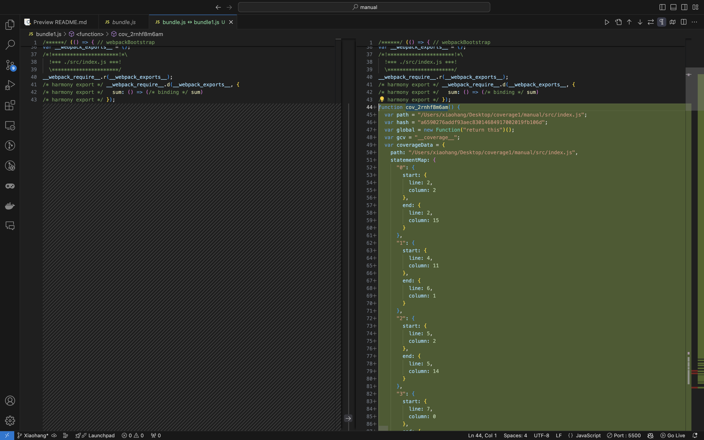

<!-- npm install --legacy-peer-deps   -->

code coverage 使用 webpack loader @jsdevtools/coverage-istanbul-loader 实现 
@jsdevtools/coverage-istanbul-loader 是对 istanbul-instrumenter-loader 的二次封装 

https://v4.webpack.js.org/loaders/istanbul-instrumenter-loader/

使用方法 
在 webpack.config.js 中添加 @jsdevtools/coverage-istanbul-loader loader

```js
   {
        test: /\.js$/,
        exclude: /node_modules|\.test\.js$/,
        enforce: 'post',
        use: {
        //   loader: 'istanbul-instrumenter-loader',
          loader: '@jsdevtools/coverage-istanbul-loader',
          options: { esModules: true }
        }
    }
```

添加完之后使用 webpack 重新打包代码



```js
{   // 所有的变量
    statementMap: {
      "0": {
        start: {
          line: 2,
          column: 2
        },
        end: {
          line: 2,
          column: 15
        }
      }
    },
    // 所有的 Function
    fnMap: {
      "0": {
        name: "sum",
        decl: {
          start: {
            line: 1,
            column: 16
          },
          end: {
            line: 1,
            column: 19
          }
        },
        loc: {
          start: {
            line: 1,
            column: 26
          },
          end: {
            line: 3,
            column: 1
          }
        },
        line: 1
      }
    },
    // 所有的 if else 
    branchMap: {
      "0": {
        loc: {
          start: {
            line: 16,
            column: 0
          },
          end: {
            line: 22,
            column: 1
          }
        },
        type: "if",
        locations: [{
          start: {
            line: 16,
            column: 0
          },
          end: {
            line: 22,
            column: 1
          }
        }, {
          start: {
            line: 16,
            column: 0
          },
          end: {
            line: 22,
            column: 1
          }
        }],
        line: 16
      }
    },
    // 给所有的变量 Function  if else 设置初始值
    s: {
      "0": 0,
    },
    f: {
      "0": 0,
      "1": 0
    },
    b: {
      "0": [0, 0],
      "1": [0, 0]
    },
   
  }

```