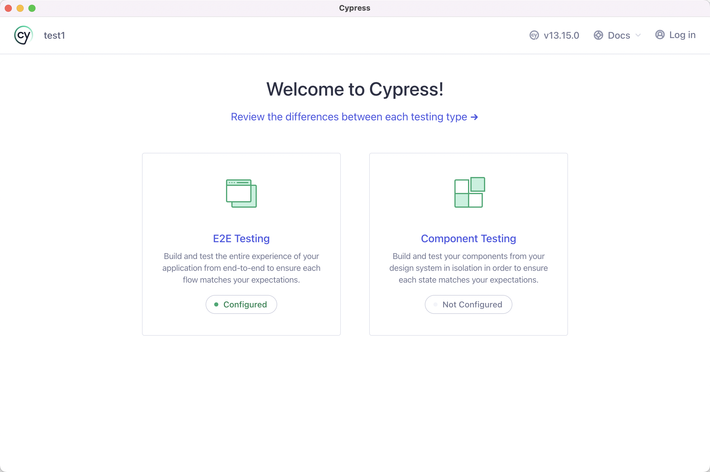

用Cypress+Angular做code coverage的优缺点，优缺点都需要举例。Deadline: Oct. 18。

Cypress
Cypress 是在 Mocha API 的基础上开发的一套开箱即用的 E2E 测试框架，并不依赖前端框架，也无需其他测试工具库，配置简单，并且提供了强大的 GUI 图形工具，可以自动截图录屏，实现时空旅行并在测试流程中 Debug 等等。

总结一下，Cypress 

优点单击

1. 真实环境测试：可以模拟用户的点击输入操作，事件驱动来验证页面渲染是否符合预期
   Cypress 有丰富的 API 可以模拟用户的点击 拖拽 滚动 等等（https://docs.cypress.io/api/table-of-contents#Queries）
   | check | 勾选复选框或单选按钮元素。 |
   | ------ | ------ |
   | clear | 清除输入或文本区域的值。 |
   | click | 单击 DOM 元素 |
   | dblclick | 双击 DOM 元素 |
   | rightclick | 右键单击 DOM 元素 |
   | scrollIntoView | 将元素滚动到视图中 |
   | scrollTo | 滚动到特定位置 |
   | select | <option>在 a 内选择一个<select> |
   | selectFile | 在 HTML5 输入元素中选择一个文件，或者模拟将文件拖到浏览器中。 |
   | trigger | 在 DOM 元素上触发事件 |
   | type | 在 DOM 元素中输入 |
   | uncheck | 取消选中复选框。 |

2. 执行速度快：由于 Cypress 直接在浏览器中运行，不需要依赖 Selenium 等驱动器，执行速度非常快
   1. Cypress 以其快速的运行速度而闻名，因为它直接在浏览器中运行测试，不需要通过网络发送命令 
   2. Selenium 通过 WebDriver 向浏览器发送命令，这可能导致比 Cypress 更慢的运行速度，尤其是在网络延迟较高的情况下。
3. 支持并行测试：Cypress 支持并行测试，可以提高测试效率，节省时间和成本
   1. 多浏览器并行测试：Cypress 允许你在不同的浏览器实例中同时运行测试。例如，你可以在 Chrome 和 Firefox 浏览器中同时运行相同的测试套件。
   2. Spec 分割：Cypress 允许你将测试用例分割成多个块（specs），然后可以并行运行这些 specs。这意味着你可以将一个大的测试文件分割成多个小文件，然后同时运行它们。
   3. 智能编排：Cypress Cloud 提供了智能编排功能，可以自动并行化测试运行，优化测试执行顺序，优先重新运行失败的测试，并在出现失败时自动取消剩余的测试运行。
4. 作为对敏捷开发，持续集成的环节补充，可以将 Code coverage 与 QA 测试同步进行
   1. 在做功能测试时，也可以直接生成 coverage 不需要再去重新写 Code coverage 节省大量时间
5. 集成简单：通过使用 @cypress/code-coverage 插件，可以轻松地将代码覆盖率测试集成到现有的 Cypress 项目中
   1. 无需配置：Cypress 提供了一个零配置的测试环境，这意味着你不需要花费大量时间来配置测试环境。它自带了一个完整的测试运行器和自动化浏览器，你只需安装 Cypress 并开始编写测试即可
   2. 安装简便：通过 npm 或 yarn 这样的包管理器，你可以轻松地安装 Cypress。安装过程简单快捷，通常只需要运行一个命令，例如 npm install cypress --save-dev。
   3. 快速启动：Cypress 允许你快速启动并运行测试。你可以立即编写测试并在本地开发环境中运行它们，而不需要等待复杂的设置过程。
   4. 直观的 API：Cypress 提供了一个直观且易于学习的 API，使得编写测试用例变得简单直观。它的链式命令和清晰的语法结构使得测试代码易于理解和维护。
   

缺点：
1. Cypress 在初始阶段因其简洁性而易于上手，但随着项目的发展和测试代码的不断积累，可能会引入复杂的封装，这增加了代码的阅读难度。这种复杂性可能导致后来的团队成员在接手项目时难以迅速理解和掌握测试框架，从而影响开发效率和测试质量。
2. 只能覆盖在测试中实际加载和执行的代码。如果某些代码或模块是动态加载的，或者在测试中没有被访问，那么这些代码将不会被覆盖率报告所包含
   比如下面的 catch 使用 Cypress 就不会被触发
    ```js

    try{
        console.log('success')
    } catch {
        console.log('Error')
    }

    ```


简单介绍一下使用方法（具体可以参照[官网](https://docs.cypress.io/)引导）：

安装：
```bash
yarn add cypress --dev
```
添加到项目的 npm 脚本中：
```json
    {
        "scripts": {
            "cypress:open": "cypress open"
        }
    }
```
启动 Cypress 项目 
```bash
npm run cypress:open
```
这就已经在本地打开了测试 GUI，可以进行测试了。


用官方文档的一个例子说明一下测试代码怎么写：

```js 
describe('My First Test', function() {
  it('Gets, types and asserts', function() {
    cy.visit('https://example.cypress.io')

    cy.contains('type').click()

    // Should be on a new URL which includes '/commands/actions'
    cy.url().should('include', '/commands/actions')

    // Get an input, type into it and verify that the value has been updated
    cy.get('.action-email')
      .type('test@email.com')
      .should('have.value', 'test@email.com')
  })
})
```
这其实已经测试了：

打开目标页面，这里是示例的 example.cypress.io， 实际上在项目里应是本地启动的 server 页面如 http://localhost:8080
找到页面的 dom 里文字内容为 'type' 的按钮，点击（如果页面里并没有渲染这个按钮即测试没跑通）
按钮点击后，页面应跳转到了路由中包含 '/commands/actions' 的页面
在此页面的 dom 里可以找到 class 类名为 '.action-email' 的 input 框，在里面输入 'test@email.com' 后，输入框的 value 值应该为 'test@email.com'

